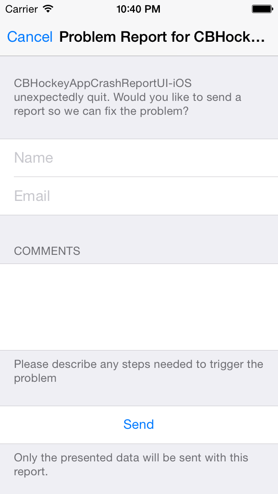

HockeyApp Crash Reporter Dialog
===============================

[](https://github.com/Carthage/Carthage)

On the Mac the HockeySDK presents a very useful UI when a crash happened. The user is asked for his
name and eMail and a short comment on what he was doing when the crash happened.

This was very often very helpful and is missing a lot on iOS. So I built this small UITableView based
dialog, you can present when a crash occurs.

How to use
==========

To replace the default UIAlert you need to do this after setting up HockeySDK:

```objective-c
__weak __typeof(self) wself = self;
[[BITHockeyManager sharedHockeyManager].crashManager setAlertViewHandler:^{
    AppDelegate *sself = wself;
    if (!sself) return;

    BITCrashDetails *details = [[BITHockeyManager sharedHockeyManager].crashManager lastSessionCrashDetails];

    UIViewController *viewCtrl = [sself.window rootViewController];
    NSString *appName = [[NSBundle mainBundle] infoDictionary][(NSString*)kCFBundleNameKey];

    [CBHockeyAppCrashReportTableViewController presentCrashReportDialogWithCrashDetails:details
                                                                                appName:appName
                                                                       onViewController:viewCtrl
                                                                               animated:YES
                                                                             completion:NULL];
}];
```

More info can be found here: http://hockeyapp.net/help/sdk/ios/3.6.1/docs/docs/HowTo-Set-Custom-AlertViewHandler.html

